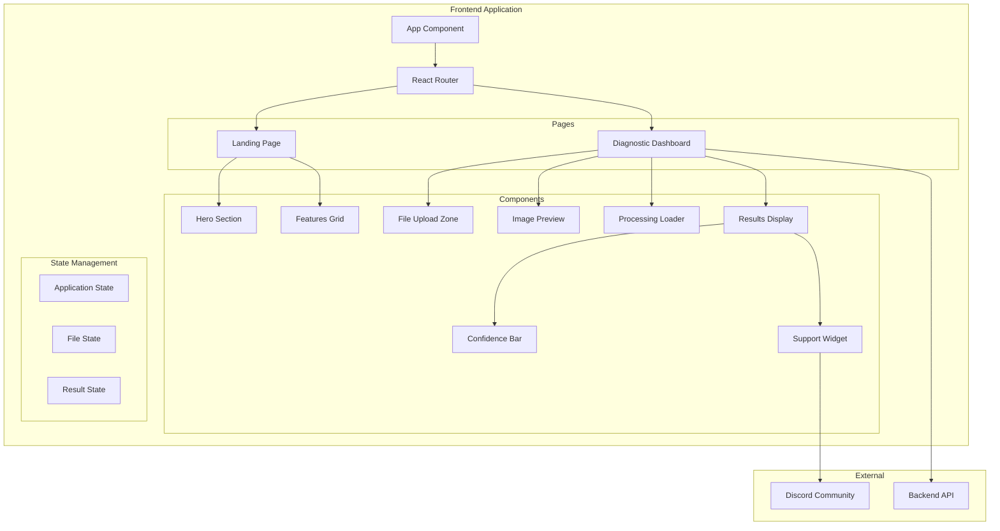

# NeuroSight AI - Frontend Design Document

## Overview

NeuroSight AI frontend is a React-based single-page application that provides an accessible, medical-grade interface for AI-powered Alzheimer's screening. The application follows a linear user flow: Landing → Upload → Processing → Results, with a calming visual design optimized for elderly users and caregivers.

The frontend communicates with a backend API for MRI analysis and renders results with confidence visualization. The design prioritizes accessibility (WCAG AA), responsive layouts, and a clean medical aesthetic using blues, whites, and teals.

## Architecture



## Components and Interfaces

### Page Components

#### LandingPage
- Renders hero section with headline and CTA
- Displays features grid with Speed, Accuracy, Community cards
- Handles navigation to Diagnostic Dashboard

#### DiagnosticDashboard
- Manages the complete diagnostic flow state machine
- Coordinates file upload, processing, and results display
- States: `idle` → `file-selected` → `processing` → `results`

### UI Components

#### HeroSection
```typescript
interface HeroSectionProps {
  headline: string;
  subheadline: string;
  ctaText: string;
  onCtaClick: () => void;
}
```

#### FeaturesGrid
```typescript
interface Feature {
  icon: string;
  title: string;
  description: string;
}

interface FeaturesGridProps {
  features: Feature[];
}
```

#### FileUploadZone
```typescript
interface FileUploadZoneProps {
  onFileSelect: (file: File) => void;
  onError: (message: string) => void;
  acceptedTypes: string[]; // ['image/jpeg', 'image/png', 'image/tiff']
  disabled: boolean;
}
```

#### ImagePreview
```typescript
interface ImagePreviewProps {
  file: File | null;
  onRemove: () => void;
}
```

#### ProcessingLoader
```typescript
interface ProcessingLoaderProps {
  isProcessing: boolean;
  message?: string;
}
```

#### ResultsDisplay
```typescript
interface ResultsDisplayProps {
  prediction: string;
  confidence: number; // 0-100
  disclaimer: string;
}
```

#### ConfidenceBar
```typescript
interface ConfidenceBarProps {
  percentage: number;
  label?: string;
}
```

#### SupportWidget
```typescript
interface SupportWidgetProps {
  discordUrl: string;
  buttonText: string;
}
```

### Service Interfaces

#### DiagnosticService
```typescript
interface DiagnosticResult {
  prediction: string;
  confidence: number;
  timestamp: string;
}

interface DiagnosticService {
  analyzeImage(file: File): Promise<DiagnosticResult>;
}
```

## Data Models

### Application State
```typescript
interface AppState {
  currentPage: 'landing' | 'dashboard';
}
```

### Diagnostic Flow State
```typescript
type DiagnosticFlowState = 'idle' | 'file-selected' | 'processing' | 'results' | 'error';

interface DiagnosticState {
  flowState: DiagnosticFlowState;
  selectedFile: File | null;
  previewUrl: string | null;
  result: DiagnosticResult | null;
  error: string | null;
}
```

### Classification Types
```typescript
type AlzheimerStage = 
  | 'Non-Demented'
  | 'Very Mild Dementia'
  | 'Mild Dementia'
  | 'Moderate Dementia';

interface DiagnosticResult {
  prediction: AlzheimerStage;
  confidence: number;
  timestamp: string;
}
```

### File Validation
```typescript
interface FileValidationResult {
  isValid: boolean;
  error?: string;
}

const ACCEPTED_MIME_TYPES = ['image/jpeg', 'image/png', 'image/tiff'];
const MAX_FILE_SIZE = 10 * 1024 * 1024; // 10MB
```

## Correctness Properties

*A property is a characteristic or behavior that should hold true across all valid executions of a system-essentially, a formal statement about what the system should do. Properties serve as the bridge between human-readable specifications and machine-verifiable correctness guarantees.*

### Property 1: Feature cards contain required elements
*For any* feature card data object, when rendered by the FeaturesGrid component, the output SHALL contain an icon element, a title element, and a description element.
**Validates: Requirements 2.3**

### Property 2: Valid image files are accepted
*For any* file with MIME type 'image/jpeg', 'image/png', or 'image/tiff', the file validation function SHALL return `isValid: true` and the file SHALL be accepted for preview.
**Validates: Requirements 3.3**

### Property 3: Invalid files are rejected
*For any* file with MIME type not in ['image/jpeg', 'image/png', 'image/tiff'], the file validation function SHALL return `isValid: false` with an appropriate error message.
**Validates: Requirements 3.4**

### Property 4: Controls disabled during processing
*For any* diagnostic flow in 'processing' state, all interactive controls (upload zone, analyze button) SHALL have their disabled attribute set to true.
**Validates: Requirements 4.2**

### Property 5: Confidence bar visualization consistency
*For any* confidence value between 0 and 100, the ConfidenceBar component SHALL render a bar with width proportional to the percentage AND display the exact percentage value as text.
**Validates: Requirements 5.2, 5.4**

### Property 6: Interactive elements meet touch target size
*For any* interactive element (button, link, clickable area), the computed dimensions SHALL be at least 44x44 pixels.
**Validates: Requirements 7.2**

### Property 7: Images have alt text
*For any* img element rendered in the application, the element SHALL have a non-empty alt attribute.
**Validates: Requirements 7.3**

### Property 8: Form inputs have associated labels
*For any* form input element, there SHALL exist a label element with a `for` attribute matching the input's `id`, OR the input SHALL be wrapped in a label element.
**Validates: Requirements 7.4**

### Property 9: No horizontal overflow at any viewport
*For any* viewport width between 320px and 1920px, the application layout SHALL not produce horizontal scrollbar (document width equals viewport width).
**Validates: Requirements 8.3**


## Error Handling

### File Upload Errors
| Error Condition | User Message | Recovery Action |
|----------------|--------------|-----------------|
| Invalid file type | "Please upload a JPG, PNG, or TIFF image file." | Clear selection, re-enable upload |
| File too large | "File size exceeds 10MB limit. Please upload a smaller image." | Clear selection, re-enable upload |
| File read error | "Unable to read the file. Please try again." | Clear selection, re-enable upload |

### API Errors
| Error Condition | User Message | Recovery Action |
|----------------|--------------|-----------------|
| Network failure | "Unable to connect to the analysis service. Please check your connection and try again." | Show retry button |
| Server error (5xx) | "The analysis service is temporarily unavailable. Please try again later." | Show retry button |
| Timeout | "Analysis is taking longer than expected. Please try again." | Show retry button |

### State Recovery
- On any error, the diagnostic flow returns to `file-selected` state if a file was uploaded, or `idle` state otherwise
- Error messages are displayed in an accessible alert component
- Users can dismiss errors and retry without page refresh

## Testing Strategy

### Testing Framework
- **Unit Testing**: Vitest with React Testing Library
- **Property-Based Testing**: fast-check library for generating test inputs
- **Accessibility Testing**: jest-axe for automated WCAG compliance checks

### Unit Testing Approach
Unit tests verify specific examples and edge cases:

1. **Component Rendering Tests**
   - Landing page renders hero section with correct headline
   - Features grid renders exactly 3 feature cards
   - File upload zone renders in idle state
   - Results display shows prediction and confidence

2. **User Interaction Tests**
   - CTA button click navigates to dashboard
   - File drop triggers onFileSelect callback
   - Analyze button click initiates processing state
   - Support button opens Discord link in new tab

3. **State Transition Tests**
   - Idle → file-selected on valid file upload
   - File-selected → processing on analyze click
   - Processing → results on API success
   - Processing → error on API failure

### Property-Based Testing Approach
Property tests verify universal properties across all valid inputs:

1. **File Validation Properties**
   - Generate random valid MIME types → all accepted
   - Generate random invalid MIME types → all rejected

2. **Confidence Bar Properties**
   - Generate random percentages 0-100 → bar width matches, text displays correctly

3. **Accessibility Properties**
   - Generate random interactive elements → all meet 44x44px minimum
   - Generate random images → all have alt text

4. **Responsive Properties**
   - Generate random viewport widths → no horizontal overflow

### Test File Structure
```
src/
├── components/
│   ├── HeroSection/
│   │   ├── HeroSection.tsx
│   │   └── HeroSection.test.tsx
│   ├── FeaturesGrid/
│   │   ├── FeaturesGrid.tsx
│   │   └── FeaturesGrid.test.tsx
│   ├── FileUploadZone/
│   │   ├── FileUploadZone.tsx
│   │   └── FileUploadZone.test.tsx
│   ├── ConfidenceBar/
│   │   ├── ConfidenceBar.tsx
│   │   └── ConfidenceBar.test.tsx
│   └── ...
├── utils/
│   ├── fileValidation.ts
│   └── fileValidation.test.ts
└── pages/
    ├── LandingPage.tsx
    ├── LandingPage.test.tsx
    ├── DiagnosticDashboard.tsx
    └── DiagnosticDashboard.test.tsx
```

### Property Test Annotations
Each property-based test must include a comment linking to the design document:
```typescript
// **Feature: neurosight-ui, Property 2: Valid image files are accepted**
// **Validates: Requirements 3.3**
```

### Test Configuration
- Property tests run minimum 100 iterations per property
- Tests run on CI for every pull request
- Accessibility tests fail build on WCAG AA violations

## Visual Design Specifications

### Color Palette
| Token | Hex | Usage |
|-------|-----|-------|
| primary-blue | #2563EB | CTA buttons, links |
| primary-teal | #0D9488 | Accents, success states |
| neutral-white | #FFFFFF | Backgrounds |
| neutral-gray-50 | #F9FAFB | Card backgrounds |
| neutral-gray-900 | #111827 | Primary text |
| error-red | #DC2626 | Error messages |

### Typography
| Element | Font | Size | Weight |
|---------|------|------|--------|
| H1 (Hero) | Inter | 48px / 3rem | 700 |
| H2 (Section) | Inter | 32px / 2rem | 600 |
| Body | Inter | 16px / 1rem | 400 |
| Button | Inter | 16px / 1rem | 600 |

### Spacing Scale
- Base unit: 4px
- Common values: 8px, 16px, 24px, 32px, 48px, 64px

### Component Specifications

#### Primary Button
- Min height: 48px
- Min width: 120px
- Padding: 12px 24px
- Border radius: 8px
- Background: primary-blue
- Text: white, 16px, 600 weight

#### File Upload Zone
- Min height: 200px
- Border: 2px dashed neutral-gray-300
- Border radius: 12px
- Background: neutral-gray-50
- Active state: Border color primary-blue, background blue-50

#### Confidence Bar
- Height: 24px
- Border radius: 12px
- Background track: neutral-gray-200
- Fill: gradient from primary-teal to primary-blue
- Percentage text: positioned right of bar
